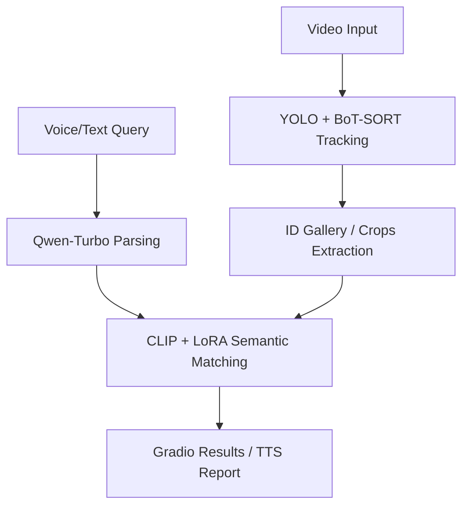

# 🚀 Human-Analysis: Multi-Modal Pedestrian Retrieval & Re-ID

<p align="center">
  
  
  
  
  
</p>

An intelligent surveillance analysis platform that combines **Computer Vision (CV)** and **Natural Language Processing (NLP)** to perform real-time person tracking and semantic-based target retrieval. This project features a fine-tuned **CLIP** model using **LoRA** (Low-Rank Adaptation) to achieve high-precision Person Re-Identification (Re-ID).

---

## 📺 Demo UI
> **Note**: Add a screenshot of your Gradio interface here to make it look professional!  
> ``

---

## ✨ Key Features

- [x] **Deep Multi-Object Tracking (MOT)**: Utilizes **YOLO** with **BoT-SORT** for robust, real-time pedestrian detection and trajectory tracking.
- [x] **Semantic Search**: Natural language queries like *"A person wearing a red jacket"* to retrieve specific targets from video streams.
- [x] **LoRA Fine-tuning**: Custom training pipeline to refine **OpenAI CLIP** on 230k+ pedestrian samples for domain-specific accuracy.
- [x] **Voice-Activated**: Integrated **OpenAI Whisper** for Automatic Speech Recognition (ASR) and **Edge-TTS** for voice-based result reporting.
- [x] **AI Reasoning**: Powered by **Qwen-Turbo** for intelligent parsing of complex user queries.

---

## 🛠 Tech Stack

| Component | Technology |
| :--- | :--- |
| **Detection/Tracking** | YOLOv8/v11, BoT-SORT |
| **Visual-Language** | OpenAI CLIP (ViT-B/32) |
| **Model Optimization** | **LoRA (PEFT)** |
| **Speech (ASR/TTS)** | Whisper & Edge-TTS |
| **LLM Reasoning** | Alibaba Qwen-Turbo |
| **Frontend UI** | Gradio |

---

## 🧠 System Architecture


---

## 🏋️ LoRA Fine-tuning Details

The model is optimized using Low-Rank Adaptation (LoRA), improving pedestrian attribute recognition while keeping training efficient.

| Parameter | Value |
| :--- | :--- |
| **Rank (r)** | 16 |
| **Alpha** | 32 |
| **Trainable Params** | ~1.28% |
| **Target Modules** | q_proj, v_proj, k_proj, out_proj |
| **Dataset Size** | 230k+ Pedestrian Images |

---

## 🔧 Installation & Setup

1. **Clone Repository**
   ```bash
   git clone https://github.com/DaVincisyy/Human-analysis.git
   cd Human-analysis
   ```
2. **Install Dependencies**
   ```bash
   pip install torch transformers peft ultralytics gradio openai-whisper openai edge-tts
   ```
3. **Configure API**
  Edit humananalysis.py:
  ```python
  import os
  os.environ["DASHSCOPE_API_KEY"] = "your_api_key_here"
  ```
4. **Run Application**
  ```python
  python humananalysis.py
  ```

---

## 👤 Author

DaVincisyy
Junior Student in Information Engineering

📫 Contact via GitHub Issues
