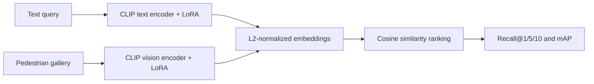

# Human-Analysis：LoRA-CLIP 文本行人检索

基于 CLIP ViT-B/32 与 PEFT LoRA 的文本行人检索项目。在 RSTPReid
上使用身份隔离的 train/validation/test 划分，统一评测 Base CLIP 与
LoRA-CLIP，并提供参数量、显存、延迟、消融实验和失败案例分析。

## 实验结果

测试协议包含 2,000 条文本查询和 1,000 张候选行人图片；同一身份的任意
图片均视为正确结果。

| Model | Recall@1 | Recall@5 | Recall@10 | mAP |
|---|---:|---:|---:|---:|
| Base CLIP | 8.90% | 21.25% | 31.05% | 6.29% |
| LoRA-CLIP | **34.70%** | **60.60%** | **72.05%** | **27.90%** |
| 绝对提升 | **+25.80** | **+39.35** | **+41.00** | **+21.61** |

主实验只训练 1,966,080 个 LoRA 参数，占模型总参数的 **1.283%**；
Adapter 文件约 7.89 MB。RTX 5060 Laptop GPU、BF16、batch size 16 下，
实测训练峰值显存约 1.40 GB。

完整实验协议见 [docs/EXPERIMENTS.md](docs/EXPERIMENTS.md)。

## 数据划分

| Split | Images | Identities | Captions per image |
|---|---:|---:|---:|
| Train | 18,505 | 3,701 | 2 |
| Validation | 1,000 | 200 | 2 |
| Test | 1,000 | 200 | 2 |

代码会在训练和评测前检查身份 ID 与文件路径交集；任何跨集合泄漏都会直接
终止实验。

## 方法


```mermaid
flowchart LR
    A["Text query"] --> B["CLIP text encoder + LoRA"]
    C["Pedestrian gallery"] --> D["CLIP vision encoder + LoRA"]
    B --> E["L2-normalized embeddings"]
    D --> E
    E --> F["Cosine similarity ranking"]
    F --> G["Recall@1/5/10 and mAP"]
```

主配置：

- CLIP ViT-B/32
- LoRA rank 16、alpha 32、dropout 0.05
- 目标层：`q_proj`、`k_proj`、`v_proj`、`out_proj`
- AdamW、学习率 1e-4、warmup + cosine decay
- BF16、batch size 16、梯度累积 2、5 epochs
- 按 validation Recall@1 保存最佳 Adapter

## 项目结构

```text
configs/
  main.yaml                 主实验配置
  smoke.yaml                64 对样本 GPU 冒烟测试
src/rstpreid_lora/
  data.py                   数据加载与身份泄漏检查
  modeling.py               Base CLIP 与 PEFT LoRA
  evaluation.py             图像/文本编码与效率统计
  metrics.py                身份级 Recall 和 mAP
train_retrieval.py          配置化 LoRA 训练
evaluate_retrieval.py       Base/LoRA 统一评测
benchmark_efficiency.py     参数、吞吐与显存测试
run_ablation_suite.py       Rank/Alpha/模块/数据规模消融
analyze_embeddings.py       相似度、UMAP 与失败案例
summarize_results.py        汇总表和对比图
humananalysis.py            YOLO + 文本/语音检索演示
```

## 环境

项目实测环境为 Python 3.12、PyTorch 2.11.0、CUDA 12.8。

```powershell
python -m venv .venv
.\.venv\Scripts\python.exe -m pip install -r requirements.txt
```

准备基础模型和数据：

```powershell
.\.venv\Scripts\python.exe -c "from huggingface_hub import snapshot_download; snapshot_download('openai/clip-vit-base-patch32', local_dir='models/clip-vit-base-patch32')"
.\.venv\Scripts\python.exe -c "from datasets import load_dataset; ds=load_dataset('tuandunghcmut/RSTPReid'); ds.save_to_disk('data/rstpreid')"
```

使用数据前请自行核验 RSTPReid 原始项目的授权与使用条款；Hugging Face
镜像的 Dataset Card 未声明明确许可证。

## 运行

验证数据隔离：

```powershell
.\.venv\Scripts\python.exe validate_dataset.py
```

Base CLIP 基线：

```powershell
.\.venv\Scripts\python.exe evaluate_retrieval.py `
  --config configs/main.yaml `
  --split test `
  --output outputs/baseline/base_test.json
```

LoRA 主实验：

```powershell
.\.venv\Scripts\python.exe train_retrieval.py --config configs/main.yaml
```

最佳 Adapter 测试：

```powershell
.\.venv\Scripts\python.exe evaluate_retrieval.py `
  --config configs/main.yaml `
  --adapter outputs/main_r16_a32_all/best_adapter `
  --split test `
  --output outputs/main_r16_a32_all/test_metrics.json
```

消融与可视化：

```powershell
.\.venv\Scripts\python.exe run_ablation_suite.py
.\.venv\Scripts\python.exe summarize_results.py
.\.venv\Scripts\python.exe analyze_embeddings.py `
  --config configs/main.yaml `
  --adapter outputs/main_r16_a32_all/best_adapter `
  --label lora_clip
```

## 多模态演示

`humananalysis.py` 保留了 YOLO 行人跟踪、Whisper、Qwen 查询解析、TTS 和
Gradio 展示逻辑。API Key、YOLO 权重、CLIP 基座与 Adapter 路径均通过环境
变量配置，参考 `.env.example`。
